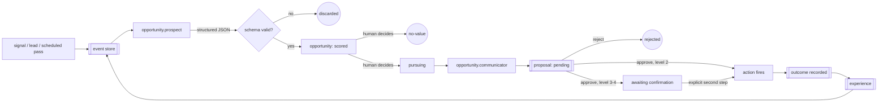

Repo head sha: 69fa3ba66bc8bca26a21b50370dbab6cc700fc71

Research topics: company-runtime automation for evidence-backed opportunities, proposals, decisions, and outcomes; signal-to-action pipelines; calendar/outreach integrations

Analogy domains to consider: game progression and reward loops; social feed and notification mechanics; marketplace liquidity and two-sided matching; developer-tool CLI ergonomics; fintech trust and verification UX

## Git history
range: last 20 commits
```text
69fa3ba Hash-chain the event log for tamper evidence
f3bba7b Add `proposals confirm` — the CLI half of the level-3/4 second step
d2dd184 Rewrite README with a full architecture overview and hero graphic
35fe436 Add cron wrapper for the Google Calendar booking poller
9e02114 Add Google Calendar booking poller (service-account, read-only)
f63860b Add e3d-applied lead-capture webhook receiver
235aa7f Deploy FutCo instance: PM2 web UI, scheduled discovery, HTML daily digest
365e3ef Phase 10: Evaluation and Metrics
a0bb5fd Phase 9: Outcome Capture and Experience Log
9493786 Phase 8: e3d-pilot Handoff Contract
24ad466 Phase 7: Pursuit: Outreach Role and Approved External Actions
63048fe Phase 6: Web UI: Opportunity and Proposal Review
b4bd942 Phase 5: Proposal, Authority Policy, and Decision Framework
37fb869 Record Phase 4's real acceptance result: milestone met
7e3c672 Fix opportunity.prospect: forward real evidence content to the LLM
e175cab Wire real web search: Tavily via a generic API-key-capable adapter
9217d78 Phase 4: Opportunity model and Opportunity Engine
701abbb Phase 3: Research/Evidence layer
b2515b4 Phase 2: Company Event Store
0e09218 Phase 1: repo scaffold, instance config, and runtime foundation
```

## Branches
```text
* main                69fa3ba Hash-chain the event log for tamper evidence
  remotes/origin/HEAD -> origin/main
  remotes/origin/main 69fa3ba Hash-chain the event log for tamper evidence
```

## GH issues and PRs
### gh issue list
- none found
### gh pr list
- none found

## Repo docs
### README.md
```text
# e3d-corp

**e3d-corp decides what a company should do next: it gathers real evidence, turns it into scored opportunities, drafts proposals for the ones worth acting on, and refuses to touch the outside world until a human explicitly approves.**


It is a company-agnostic, event-sourced runtime built on seven durable primitives — **Event → Opportunity → Proposal → Decision → Action → Outcome → Experience**. Models are replaceable reasoning components inside that runtime, not employees with job titles: a role receives explicit inputs, returns structured JSON matching a schema, and deterministic code does everything else. Every state transition is an append-only event carrying `causationId` and `correlationId`, so any conclusion the system reaches can be replayed from the originating signal to the measured outcome.

## Why we built this

Most "AI company" projects start from the org chart: give a model a name badge, let it move records around, and call the resulting activity progress. That produces motion, not decisions — and the moment one of those agents can actually send an email or move money, the interesting question stops being "can it imitate an employee?" and becomes "what happens when it's wrong?"

The scarce resource at a small company is rarely bookkeeping capacity. It's *noticing* — spotting the consulting engagement, the partnership, the competitor move, the piece of internal work that would pay for itself, and doing it early enough to matter. That work is genuinely hard to automate honestly, because it depends entirely on real evidence: a recommendation grounded in a fabricated capability claim is worse than no recommendation at all.

So e3d-corp is built the other way around. Research and scoring run continuously and autonomously, because reading the world is safe. Everything with a consequence — sending outreach, handing work to another system, touching money, closing a deal — stops at a gate that only a human can open, enforced inside the action functions themselves rather than as a courtesy check in the UI. The system's job is to bring you a short, well-evidenced list and the context to judge it. Deciding remains yours.

## What it does differently

- **Never lets a model mutate company state.** Roles return structured JSON validated against an explicit schema. Deterministic code applies policy, owns every state transition, and controls every side effect. A malformed or over-reaching model response fails validation; it does not become a decision.
- **Never trusts a caller's claim about how much authority an action needs.** `authorityLevel` is derived from a versioned policy table by action type (`lib/authority/policy.js`), never accepted as input, so a role can't under-declare the authority its own proposal requires.
- **Never fires a consequential action without a logged human Decision.** `assertProposalAuthorized` runs as the first line of every action executor and fails closed on an unknown type, a type/level mismatch, or a proposal that isn't `approved`. No config flag or environment variable bypasses it.
- **Never implements a decision twice.** The CLI and the web UI call the same library functions for every transition. A Decision records `via: "cli" | "web"` for traceability — that is the *only* difference between the two surfaces.
- **Never confuses approval with success.** A Decision (a human said yes) and an Outcome (the world responded) are separate records captured at separate times. Evaluation metrics keep them apart, so "approved" never quietly counts as "worked."
- **Never invents evidence.** Every claim traces back to an `evidence.gathered` event holding the actual query and the actual result, from the company's own knowledge base (via MCP) or a web-search adapter. Degraded providers are recorded as degraded rather than silently skipped.
- **Never lets history be edited quietly.** Every record in the event log carries a `prevHash` linking it to its predecessor and a `hash` over its own content, so altering any past record invalidates everything written after it. `event verify` walks the chain and names the first bad record.
- **Never commits real business data.** Instance data — prospects, findings, decisions, revenue — lives in a gitignored directory outside the tracked tree. The repo ships a placeholder example config and nothing else.

## The runtime loop



1. **Event** — every signal lands in an append-only `events.jsonl`: a scheduled research pass, an inbound lead, a calendar booking, or a hand-added event. This file is the single source of truth; Opportunities and Proposals are folded from it, never stored separately.
2. **Research** — the evidence layer queries the company knowledge base over MCP and a pluggable web-search provider, appending an `evidence.gathered` event per call with the real query and result attached.
3. **Opportunity** — the `opportunity.prospect` role reads the trigger and its evidence and returns candidate opportunities as structured JSON. Anything failing `validateOpportunityCandidate` is rejected outright rather than guess-parsed.
4. **Scoring** — deterministic, not a second model call. Role confidence, evidence count, and trigger recency combine under configurable weights and a per-type multiplier into one sortable `score.value`.
5. **Decision (what to pursue)** — a human moves an opportunity to `reviewed`, `pursuing`, or `no-value`. The underlying write is only authority level 1, but this is always an explicit human call: it's a product choice about where judgment belongs, not a safety requirement.
6. **Proposal** — for `pursuing` opportunities, `opportunity.communicator` drafts a concrete action as a Proposal with a payload and a `proposedBy: { role, provider, model }` attribution. Drafting is autonomous; the proposal sits `pending`.
7. **Decision (approve/reject) and Action** — approving a level-2 proposal fires its action in the same call, because the action is reversible and adding friction to reversible things is just friction. Level 3 and 4 approve *only*; execution needs a separate, explicit confirmation step.
8. **Outcome → Experience** — real-world results are recorded as their own events. Once a chain reaches a Decision or an Outcome it is assembled into an Experience record, which is what the evaluation layer measures. Role and model attribution come only from what the log actually recorded — never reconstructed by guesswork.

## Authority levels

Levels are defined once, in full, so adding a higher-consequence action later can't force a breaking schema change. Only the levels that are actually needed are exercised.

| Level | Meaning | Requires a human Decision? | Examples |
|:-----:|---------|---------------------------|----------|
| **0** | Observe — read-only research and ingestion | No, fully autonomous | web search, knowledge-base queries, ingesting a lead |
| **1** | Internal / reversible write | No, fully autonomous | create or score an Opportunity, draft a Proposal, add a note |
| **2** | External / reversible action | **Yes** — approval and execution are one call | `send-outreach`, `pilot-handoff` |
| **3** | Financial / contractual action | **Yes** — approval, then a separate confirmation | `issue-invoice` |
| **4** | Irreversible / high-value action | **Yes** — approval, then a separate confirmation | `mark-deal-closed` |

Levels 0–1 never produce a Proposal at all. Levels 2–4 always do, and the mapping from action type to required level lives in one versioned table. An action type with no policy entry is refused rather than treated as autonomous — the failure mode is "nothing happens," never "it happened unsupervised."

Today `send-outreach` and `pilot-handoff` have registered executors. `issue-invoice` and `mark-deal-closed` have policy entries but no executor yet: the guard exists ahead of the capability, deliberately.

## An Opportunity is not a sales lead

That's the most common thing to get wrong about this system. An Opportunity is any evidence-backed action the company should consider, including:

`consulting-engagement` · `product-opportunity` · `feature-signal` · `partnership` · `distribution` · `technology-to-investigate` · `market-trend` · `competitor-development` · `event-to-attend` · `integration-opportunity` · `operational-improvement` · `cost-saving` · `other`

The list is illustrative, not an enum — `type` is an open string, and instance config can weight any type up or down. A repeated customer request that implies a missing feature, a competitor's launch, a conference worth attending, and a cost-saving change to internal tooling are all first-class opportunities that flow through exactly the same pipeline as a prospective client.

Statuses: `candidate` → `scored` → `reviewed` → `pursuing` → `won` / `lost`, with `no-value` available at any point.

## Requirements and installation

Node.js 18+ is the only runtime requirement. The single production dependency is the AWS SES client, used by the outreach transport.

```bash
git clone https://github.com/spacepacket1/e3d-corp.git
cd e3d-corp
npm install
node bin/e3d-corp --help
```

You also need an OpenAI-compatible LLM endpoint. Any will do; the reference deployment points at a local Qwen2.5 served over MLX, so no company data leaves the machine.

## Configure an instance

One JSON file is the entire contract between e3d-corp and a company. Start from [`examples/instance.example.json`](examples/instance.example.json).

| Field | Required | Purpose |
|-------|:--------:|---------|
| `name` | ✓ | Instance name; selects the config under `.e3d-corp/instance/<name>/` |
| `dataDir` | ✓ | Private, gitignored directory holding this instance's real data |
| `llm` | ✓ | `{ baseUrlEnvVar, modelEnvVar }` — *names* of env vars, never values |
| `research` | ✓ | `{ futcoMcpUrl, webSearchProvider, webSearchApiKeyEnvVar }` |
| `eventSources` | ✓ | Declared inbound signal sources |
| `roles` | ✓ | Role name → `{ provider, model }`; models are assigned, not hard-coded |
| `researchTopics` | | Topics the scheduled discovery pass sweeps |
| `scoring` | | `weights` and per-type `typeWeights` |
| `outreach` | | `{ provider, region, fromEmail, fallbackToEmail }` for SES |
| `web` | | `{ authUserEnvVar, authPassEnvVar, port }` |
| `leadWebhook` | | `{ tokenEnvVar }` — bearer token for the inbound lead endpoint |
| `calendar` | | `{ provider, calendarId, organizerEmail, serviceAccountKeyFileEnvVar }` |
| `authorityNotify` | | `{ email, command }` — best-effort ping when level-2+ approvals are pending |

Validate it:

```bash
node bin/e3d-corp config validate examples/instance.example.json
```

### Secrets are never in the config

Config holds the **name** of an environment variable, never its value. `llm.baseUrlEnvVar`, `web.authPassEnvVar`, `leadWebhook.tokenEnvVar`, and `calendar.serviceAccountKeyFileEnvVar` are all indirections. Actual credentials live in an env file inside the gitignored instance directory and are sourced at launch. This is what makes it safe for the config contract to be a tracked, reviewable artifact.

## Operator workflow

Discover — the scheduled pass that sweeps `researchTopics`, gathers evidence, and produces scored opportunities:

```bash
node bin/e3d-corp run --instance <name>
```

Review what it found, then decide. Nothing advances past `scored` on its own:

```bash
node bin/e3d-corp opportunities list --instance <name> --min-score 0.6
node bin/e3d-corp opportunities show <id>
node bin/e3d-corp opportunities decide <id> --status pursuing --reason "Worth a first email"
```

Draft actions for everything now marked `pursuing` (skips opportunities that already have one):

```bash
node bin/e3d-corp pursue --instance <name>
```

Review and decide on the resulting proposals. Approving a level-2 proposal sends the outreach in that same call:

```bash
node bin/e3d-corp proposals list --status pending
node bin/e3d-corp proposals show <id>
node bin/e3d-corp proposals approve <id> --reason "Good fit, send it"
node bin/e3d-corp proposals reject  <id> --reason "Wrong segment"
```

A level-3 or level-4 proposal is only *approved* by that call — its action does not fire. The separate confirmation is its own command, which takes no `--reason`, because the deliberation already happened at approval and this step is just "yes, actually do it now":

```bash
node bin/e3d-corp proposals confirm <id>
```

Record what actually happened, then read the assembled chain:

```bash
node bin/e3d-corp outcomes record --correlation <id> --type meeting.booked --payload '{"note":"30m intro call"}'
node bin/e3d-corp experience show <correlationId>
node bin/e3d-corp event log --correlation <correlationId>
node bin/e3d-corp evaluate report --since 2026-01-01
node bin/e3d-corp event verify
```

Outcome types: `prospect.replied`, `meeting.booked`, `proposal.accepted`, `outcome.proposal.rejected`, `deal.won`, `deal.lost`, `invoice.paid`, `capability.shipped`, `customer.adopted`, `opportunity.no-value`.

> Both surfaces reach the same second step: `proposals confirm` on the CLI and `POST /proposals/:id/confirm` in the web UI are thin calls into one `confirmAndExecute`. Every refusal — not approved, wrong authority level, no registered executor — is enforced there, not re-checked per surface.

## Web UI

The web UI is the primary human interface, built early rather than bolted on, because reviewing and approving is the real ongoing work this system creates.

```bash
node bin/e3d-corp web --instance <name> --port 3010
```

It is a hand-rolled Node HTTP server — no framework, no build step, no SPA toolchain. Basic auth is mandatory and the server refuses to start without credentials; there is no unauthenticated mode, because there is no demo data that would be safe to serve unauthenticated. Mutating routes are POST-only with same-site-cookie CSRF protection.

| Route | Purpose |
|-------|---------|
| `/opportunities` | Ranked list, filterable by status and score |
| `/opportunities/:id` | Detail, evidence chain, and the decide form |
| `/proposals` | Pending and decided proposals |
| `/proposals/:id` | Detail, with approve / reject / confirm |
| `/actions` | Every action that actually fired |
| `/outcomes` | Recorded real-world outcomes |
| `/metrics` | The evaluation report |

## Event sources

Three inbound paths exist today, all converging on the same engine:

- **Scheduled discovery** — `e3d-corp run` sweeps `researchTopics` on whatever cadence you schedule. e3d-corp does not ship a scheduler; use cron or PM2.
- **Lead webhook** — `POST /webhooks/e3d-applied-lead` accepts a lead-capture submission authenticated by a bearer token compared in constant time. It sits *before* the basic-auth gate, since it is machine-to-machine. It records the lead, responds immediately, then runs the opportunity engine out of band so the caller isn't held open for an LLM round trip.
- **Google Calendar bookings** — for contact forms whose call-to-action is an appointment-schedule booking rather than a form post. A poller authenticates as a service account using a hand-rolled RFC 7523 JWT bearer flow (no `googleapis` dependency), lists upcoming events, and records unseen ones as leads. Deduplication queries the event store for already-recorded Google event IDs rather than keeping a separate state file — `events.jsonl` stays the only source of truth.

Adding a source means writing something that appends a well-formed event and calls `runOpportunityEngine`. The engine itself has no idea where its trigger came from.

## Tamper evidence

`events.jsonl` was append-only by convention — nothing structurally stopped a past record from being edited in place, which is precisely the property an audit trail is supposed to have. Every record now carries:

```
prevHash  — the hash of the record before it (null for the first, a seal for a pre-chaining prefix)
hash      — sha256 over this record's canonical form, prevHash included
```

Because each hash covers the previous link, every record commits to the entire history behind it. Editing one record, or deleting one from the middle, invalidates every record after it:

```bash
node bin/e3d-corp event verify
# Event chain intact: 412 of 412 records verified
# Event chain BROKEN at record 137: record 137 (id 8a3c…) hashes to …, but carries … — this record's own content was altered
```

Adoption needed no rewriting of existing history: the first chained record's `prevHash` is a **seal** over the unchained prefix, so records written before this existed are still covered from that point forward. On FutCo's real 71-event log, altering any of those 71 breaks verification at record 71.

Hash chaining also makes every append a read-modify-write, so appends now take an exclusive lock. Without it, the 07:00 discovery pass and the :00 calendar poll — which genuinely overlap — could both claim the same `prevHash` and fork the chain.

**What this does not do**, stated plainly:

- It does not stop the operator from rewriting the whole file and recomputing every hash. Detection of *partial* edits is the guarantee; a full rewrite needs an external copy to catch.
- It does not detect **truncation of the tail** — what remains is a valid prefix. There's a test asserting exactly this so the limit stays visible.
- It does not make recorded facts *true*. Integrity of the record is not accuracy of the record.

Closing the first two takes an external anchor: publish the latest hash somewhere you don't control — an offsite copy, a signed commit, a timestamping service, or a chain if a counterparty ever demands one. That publishes 32 bytes and no business content, which is the only version of "put it on-chain" compatible with never letting client names and deal amounts leave the instance directory.

The primitives live in [`lib/store/appendOnlyLog.js`](lib/store/appendOnlyLog.js) rather than inside the event store, so Phase 11's `ledger.jsonl` inherits the same chain instead of inventing a second one.

## Scoring

Scoring is deliberately deterministic — asking a model to score its own output is how you get confident nonsense:

```
score.value = ( w_confidence · confidence
              + w_evidence   · min(evidenceCount / 5, 1)
              + w_recency    · recencyFactor(triggerOccurredAt) )
              × typeMultiplier
```

`recencyFactor` decays linearly from 1.0 to 0.0 over 30 days, so a fresh signal outranks a stale one all else equal. `typeMultiplier` comes from `scoring.typeWeights[type]` and defaults to 1, which lets an instance emphasize whole categories — say, weighting consulting engagements above market trends — without touching the scoring code.

## Handoff to e3d-pilot

An opportunity whose answer is "we should build this" doesn't stay a document. `opportunities propose-handoff` produces a level-2 proposal that, on approval, writes a handoff artifact matching [e3d-pilot](https://github.com/spacepacket1/e3d-pilot)'s actual config contract — verified against its real input shape, not an assumed one. e3d-pilot takes it from idea to a draft PR under its own two approval gates.

The loop closes with `opportunities check-shipped`, which re-queries the knowledge base for evidence that the capability now exists and records a `capability.shipped` outcome when it does. Neither repo imports the other; the contract is a file.

## Evaluation

`evaluate report` computes, over real events only:

- opportunities discovered, broken down by type
- opportunity acceptance rate (`pursuing` vs `no-value`) and proposal rejection rate
- the outreach funnel — sent → replied → meetings booked → deals won
- revenue attributable to chains that started here
- cost per useful opportunity, where "useful" means the chain reached a genuinely positive outcome
- latency and cost by role and model

Counts come from the event store; per-chain economics come from assembled Experience records, since only a completed chain has a meaningful cost. Anything with no data reports `n/a` rather than a fabricated zero.

## Deployment

Node plus a scheduler is the whole story. The reference deployment runs the web UI under PM2 and drives everything else from cron: a nightly discovery pass, a morning HTML digest over SES, and a booking poll every 15 minutes. Wrapper scripts under `ops/run/` source the instance env file before exec'ing the relevant entry point, keeping secrets out of crontab.

There is no message queue, no external database, and no distributed event bus. At a small company's scale the thing that matters is a semantic contract and a replayable audit trail, not infrastructure.

## What never gets committed

`.e3d-corp/instance/` is gitignored in its entirety. No real client names, deal amounts, revenue figures, research findings about real prospects, credentials, or service-account keys enter this repository's history — ever. The tracked tree carries code, a placeholder example config, and this document.

## Testing

```bash
npm test          # node --test
npm run check     # syntax check + full suite
```

Ten suites — one per implemented phase, 90 tests — run against the real library functions rather than mocks, including live integration against the knowledge-base MCP server.

## Status

Phases 1–10 are implemented: runtime foundation, event store, research layer, opportunity engine, authority and decision framework, web UI, pursuit and outreach, the e3d-pilot handoff, outcome and experience capture, and evaluation.

Phase 11 — CRM, ledger, and a bookkeeper role — is specified but deliberately unbuilt. It waits until the pursuit phases produce enough real deal volume to justify it. Model fine-tuning, multi-model negotiation for high-authority decisions, and any mechanism for adding roles are all gated on evidence from the evaluation layer that they would improve real outcomes. None of them ship early merely because they're possible.

## License

MIT. See [LICENSE](LICENSE).

```

## TODO/FIXME matches
- none found
